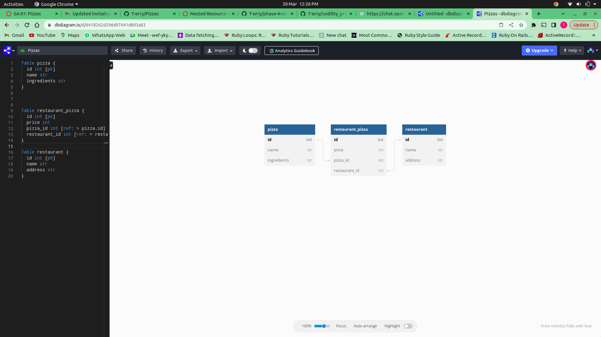

### PHASE 4 CODE CHALLENGE WEEK 1

#### Projects name

    - Pizza Restaurant

#### author information

    The following projects are created by:
    - Terry Wachuka
    - on 17/03/2023

#### setup/installation requirements

    - download a zip file under code tab.
    - extract the downloaded zip folder
    - open the folder with VS code
    - Run this command on the terminal to run server:
    console $ rails server
    - Use Postman to view the data through routes in BDD

##### ERD

##### BDD

As a user should;

    - GET /restaurants return all restaurants in an array

    - GET /restaurants/:id return the restaurant matching the id together with all pizza array including all pizzas related to the restaurant.

    - DELETE /restaurants/:id should delete the restaurant matching the id together with the restaurant_pizzas instances related to it.

    - GET /pizzas return all pizzas in an array

    - POST /restaurant_pizzas this route should create a new 
    `RestaurantPizza` that is associated with an existing `Pizza` and `Restaurant`

##### Known Bugs

    The application works perfectly well, no bugs.

#### technologies used

    The following projects used the technologies
    :
    - RUBY, 2.7.4
    - RAILS
    - Active Record

#### Support and Contact information

    Email: terrywachuka10@gmail.com
    

#### License and Copyright Information

